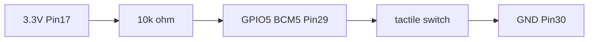

# GPIO Input 回路仕様

GPIO input / onchange を確認する最小回路を固定する。配線情報だけで同じ回路を Raspberry Pi 上で再現できることが完了条件。

関連:

- 親 Issue: [#51 GPIO Input example を作成する](https://github.com/gurezo/chirimen-raspi-docker/issues/51)
- 子 Issue: [#109 GPIO Input 回路仕様を決定する](https://github.com/gurezo/chirimen-raspi-docker/issues/109)
- Browser GPIO Input UI: web-demo の GPIO Input（`#/gpio-input`）。[#110](https://github.com/gurezo/chirimen-raspi-docker/issues/110)
- onchange UI: web-demo の GPIO Input が Start 後に `onchange` で realtime 更新する。[#111](https://github.com/gurezo/chirimen-raspi-docker/issues/111)
- Cleanup 検証: Stop / unsubscribe / 画面離脱 / reload / WebSocket 切断 / Runtime 再起動。[#112](https://github.com/gurezo/chirimen-raspi-docker/issues/112)
- 操作手順つきガイド: [gpio-input.md](../guides/gpio-input.md)（#113）
- HTML サンプル: [docs/examples/button/](./button/)
- LED 回路（共存可）: [gpio-led-blink.md](./gpio-led-blink.md)（BCM 26）
- 参考: [chirimen `gc/gpio/button`](https://github.com/chirimen-oh/chirimen/tree/master/gc/gpio/button)

web-demo の GPIO port 定数は `apps/web-demo/src/gpio-input.ts` の `GPIO_INPUT_PORT`（`5`）。`navigator.requestGPIOAccess().ports.get(5)` で参照する。

旧 button サンプルは GPIO5 のスイッチに加えて GPIO26 の LED を `onchange` で点灯する。LED 配線は [gpio-led-blink.md](./gpio-led-blink.md) に任せる。本仕様はスイッチ（入力）側のみを採用する。

## 目的

Raspberry Pi 3 / 4 / 5 で共通の、3.3V GPIO に安全なタクトスイッチ + プルアップ回路を 1 つに決める。web-demo の Input UI と [操作ガイド](../guides/gpio-input.md) はこの文書を正本とする。

## ピン対応

| 役割 | BCM（`ports.get`） | 40-pin header 物理 pin | 備考 |
| --- | --- | --- | --- |
| GPIO input | `5` | `29` | Pi 3 / 4 / 5 で同一。polyfill の `CHIRIMEN_GPIO_PORTS` に含まれる。旧 button と同じ |
| GND | — | `30` | GPIO5 に隣接。他の GND ピンでも可 |
| 3.3V（プルアップ） | — | `17` | 外部 10kΩ の一端。他の 3.3V ピン（物理 1）でも可 |

```text
requestGPIOAccess()
  → ports.get(5)
  → export('in')
  → read() / onchange
  → 離すと 1 / 押すと 0（active LOW、プルアップ）
```

旧 button の `onchange` は値そのもの（`val === 0`）を受け取る。本 Runtime の Browser Polyfill は `{ value, portNumber }` を渡す。論理は同じ（離す=`1`、押す=`0`）。

## 必要部品

| 部品 | 数量 | 仕様 |
| --- | --- | --- |
| タクトスイッチ | 1 | SPST、モーメンタリ（押している間だけ ON）。2 pin を想定 |
| プルアップ抵抗 | 1 | **10kΩ** |
| ジャンパワイヤ | 3 本以上 | GPIO5、GND、3.3V へ |

4 pin タクトスイッチを使う場合、端子が出ている向き（縦）は常時導通で、それと直交する方向がボタンで切り替わる。ジャンパは直交方向の端子へつなぐ。

## 配線

外部プルアップ / active LOW。離すと `1`、押すと `0`（旧 button の「スイッチは Pullup で離すと 1」と同じ）。

```text
3.3V (物理 pin 17)
  → 10kΩ
  → GPIO5 (物理 pin 29) ─┬─ タクトスイッチ ─→ GND (物理 pin 30)
```



手順:

1. 10kΩ の一端を **物理 pin 17**（3.3V）へ接続する
2. 10kΩ の他端を **物理 pin 29**（BCM 5）へ接続する
3. タクトスイッチの一端を **物理 pin 29**（BCM 5）へ接続する
4. タクトスイッチの他端を **物理 pin 30**（GND）へ接続する

旧 [gc/gpio/button](https://github.com/chirimen-oh/chirimen/tree/master/gc/gpio/button) は内部プルアップのみ（抵抗なし）で GPIO5 と GND をスイッチでつなぐ。Pi 3 / 4 では GPIO 0–8 の default が内部プルアップのため動くことが多い。本 Runtime は pull 設定 API を持たず、Pi 5（RP1）の default pull は Pi 3 / 4 と異なるため、**外部 10kΩ プルアップを正本**にする。

## 3.3V GPIO で安全な構成

Raspberry Pi の GPIO は **3.3V** ロジックである。本回路は入力ピンを 3.3V か GND のどちらかに必ずつなぐ。

| 項目 | 値 |
| --- | --- |
| GPIO 電圧 | 3.3 V |
| プルアップ抵抗 | 10 kΩ |
| 離したときのピン電圧 | 約 3.3 V（`read()` → `1`） |
| 押したときのピン電圧 | 0 V（`read()` → `0`） |
| 押下時の抵抗電流 | 約 0.33 mA（`3.3 / 10000`） |

禁止:

- **5V ピン**（物理 pin 2 / 4）へ接続しない
- プル無しの浮遊入力を正本にしない（onchange が不安定になる）
- GPIO 同士を短絡しない
- 外部電源や 5V ロジックを GPIO に直接入れない

## Raspberry Pi 3 / 4 / 5 の pin assignment

| 確認項目 | 結果 |
| --- | --- |
| 40-pin header | Pi 3 / 4 / 5 で物理 pin 29 = BCM 5、pin 30 = GND、pin 17 = 3.3V |
| default I2C | BCM 2 / 3（物理 3 / 5）。本回路の 5 とは重ならない |
| default UART | BCM 14 / 15。本回路の 5 とは重ならない |
| LED Blink | BCM 26（物理 37）。本回路の 5 とは重ならないため同時配線できる |
| Browser Polyfill | `CHIRIMEN_GPIO_PORTS` に `5` が含まれる |

モデルごとに配線を変える必要はない。内部プルアップに依存しない。Compatibility matrix は [compatibility.md](../architecture/compatibility.md) を参照。

## 期待結果

配線後、GPIO5 を input にして `read()` すると、離したとき `1`、押したとき `0` になる。`onchange` は値が変わるたびに同じ `0` / `1` を通知する。

web-demo の GPIO Input（`#/gpio-input`）では Start で `export('in')` と初回 `read()` をし、`onchange` で入力変化を realtime 表示する。Read で再読込、Stop / 画面離脱 / reload / 切断で `onchange` 解除と `unexport` をする。HTML サンプル（[docs/examples/button/](./button/)）は旧 button と同じく GPIO26 の LED を `onchange` で点灯する。Cleanup の詳細は下記、操作手順は [gpio-input.md](../guides/gpio-input.md)。

## Cleanup

Demo 終了後に GPIO5 の watch / session を残さない。次のタイミングで `onchange` を解除し、`unexport` する。

| タイミング | クライアント | サーバ |
| --- | --- | --- |
| Stop button | `GpioInputSession.stop()`（`onchange = null` → `unexport`） | `gpio.unsubscribe` → `gpio.unexport` |
| unsubscribe | `onchange = null`。後続の `gpio.onchange` は無視する | `gpio.unsubscribe`。最後の購読解除で watch 停止 |
| page navigation | `#/gpio-input` 以外への `hashchange` で `stop()` | `gpio.unsubscribe` → `gpio.unexport` |
| browser reload | `pagehide` で `stop()`（await しない best-effort） | WebSocket `close` → `GpioSession.releaseAll()`（watch 停止 + unexport） |
| WebSocket disconnect | Connected 以外の接続状態で `stop()`。再接続後は自動再開しない | WebSocket `close` → `GpioSession.releaseAll()` |
| Runtime restart | 切断ステータスで `stop()`。再接続後は自動再開しない | shutdown の `cleanupAll()` → `releaseAll()` → process 全体の `unexportAll` |

切断中の `unexport` RPC が失敗しても、Browser Polyfill はローカルの `exported` を落とす。web-demo は切断時に session を止めるため、reconnect で watch を張り直さない。サーバ側は切断時と shutdown 時に必ず `releaseAll()` する。

完了条件: GPIO Input 終了後に GPIO watch / session が残らず、同じ GPIO port（BCM 5）を再度 `export` できる。
