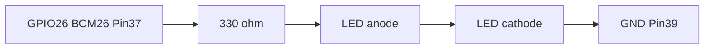

# GPIO LED Blink 回路仕様

実機検証可能な最小 GPIO output 回路を固定する。配線情報だけで同じ回路を再現できることが完了条件。

関連:

- 親 Issue: [#50 GPIO LED Blink example を作成する](https://github.com/gurezo/chirimen-raspi-docker/issues/50)
- 子 Issue: [#105 LED Blink の回路仕様を決定する](https://github.com/gurezo/chirimen-raspi-docker/issues/105)
- Blink UI（Start / Stop）: web-demo の GPIO Output（`#/gpio-output`）。[#106](https://github.com/gurezo/chirimen-raspi-docker/issues/106)
- Cleanup 検証: Stop / 画面離脱 / reload / WebSocket 切断。[#107](https://github.com/gurezo/chirimen-raspi-docker/issues/107)
- 操作手順つきガイド: [#108](https://github.com/gurezo/chirimen-raspi-docker/issues/108)
- 参考: [chirimen.org hello-real-world（Lチカ）](https://github.com/chirimen-oh/chirimen.org/tree/master/pizero/src/esm-examples/hello-real-world)

web-demo の GPIO port 定数は `apps/web-demo/src/gpio-led-blink.ts` の `LED_BLINK_GPIO_PORT`（`26`）。`navigator.requestGPIOAccess().ports.get(26)` で参照する。

モータ配線は本仕様の対象外（hello-real-world の Lチカ部分のみを採用する）。

## 目的

Raspberry Pi 3 / 4 / 5 で共通の、3.3V GPIO に安全な LED + 抵抗回路を 1 つに決める。web-demo の Blink UI とガイド（#108）はこの文書を正本とする。

## ピン対応

| 役割 | BCM（`ports.get`） | 40-pin header 物理 pin | 備考 |
| --- | --- | --- | --- |
| GPIO output | `26` | `37` | Pi 3 / 4 / 5 で同一。polyfill の `CHIRIMEN_GPIO_PORTS` に含まれる |
| GND | — | `39` | GPIO26 に隣接。他の GND ピンでも可 |

```text
requestGPIOAccess()
  → ports.get(26)
  → export('out')
  → write(1) で点灯 / write(0) で消灯
```

## 必要部品

| 部品 | 数量 | 仕様 |
| --- | --- | --- |
| LED | 1 | 一般的な 3 mm / 5 mm。赤を想定（Vf 約 2.0 V） |
| 電流制限抵抗 | 1 | **330Ω**（推奨）。1 kΩ でも可（より暗い） |
| ジャンパワイヤ | 2 本以上 | GPIO26 と GND へ |

## 配線

current source / active HIGH。`write(1)` で点灯、`write(0)` で消灯（hello-real-world と同じ）。

```text
GPIO26 (物理 pin 37)
  → 330Ω
  → LED アノード（長い足）
  → LED カソード（短い足）
  → GND (物理 pin 39)
```



手順:

1. 抵抗の一端を **物理 pin 37**（BCM 26）へ接続する
2. 抵抗の他端を LED の **アノード**（長い足）へ接続する
3. LED の **カソード**（短い足）を **物理 pin 39**（GND）へ接続する

## 3.3V GPIO で安全な構成

Raspberry Pi の GPIO は **3.3V** ロジックである。本回路は次の前提で電流を抑える。

| 項目 | 値 |
| --- | --- |
| GPIO 電圧 | 3.3 V |
| 赤 LED の Vf（目安） | 約 2.0 V |
| 抵抗 330Ω の電流 | 約 4 mA（`(3.3 − 2.0) / 330`） |
| 抵抗 1 kΩ の電流 | 約 1.3 mA |
| GPIO 1 ピンの目安 | 推奨数 mA、上限はおよそ 16 mA を超えない |

禁止:

- **抵抗なし**で LED を GPIO に接続しない（過電流でピンと LED を壊す）
- **5V ピン**（物理 pin 2 / 4）へ接続しない
- GPIO 同士を短絡しない
- 外部電源や 5V ロジックを GPIO に直接入れない

## Raspberry Pi 3 / 4 / 5 の pin assignment

| 確認項目 | 結果 |
| --- | --- |
| 40-pin header | Pi 3 / 4 / 5 で物理 pin 37 = BCM 26 |
| default I2C | BCM 2 / 3（物理 3 / 5）。本回路の 26 とは重ならない |
| default UART | BCM 14 / 15。本回路の 26 とは重ならない |
| Browser Polyfill | `CHIRIMEN_GPIO_PORTS` に `26` が含まれる |

モデルごとに配線を変える必要はない。Compatibility matrix は [docker.md](../architecture/docker.md#compatibility-matrix) を参照。

## 期待結果

配線後、GPIO26 を output にして `write(1)` すると LED が点灯し、`write(0)` すると消灯する。

web-demo の GPIO Output（`#/gpio-output`）で Start を押すと 1 秒間隔で点滅し、Stop で消灯して unexport する。終了後は同じ GPIO26 を再度 `export` できる。操作手順・Troubleshooting は [#108](https://github.com/gurezo/chirimen-raspi-docker/issues/108)。

## Cleanup

Demo 停止後に GPIO26 を残さない。次のタイミングで点滅を止め、`write(0)` のあと `unexport` する。

| タイミング | クライアント | サーバ |
| --- | --- | --- |
| Stop button | `LedBlinkSession.stop()` | `gpio.unexport` |
| page navigation | `#/gpio-output` 以外への `hashchange` で `stop()` | `gpio.unexport` |
| browser reload | `pagehide` で `stop()`（await しない best-effort） | WebSocket `close` → `GpioSession.releaseAll()` |
| WebSocket disconnect | Connected 以外の接続状態で `stop()`。再接続後は自動再開しない | WebSocket `close` → `GpioSession.releaseAll()` |

切断中の `unexport` RPC が失敗しても、Browser Polyfill はローカルの `exported` を落とす。reconnect でピンを取り直さない。サーバ側は切断時に必ず `releaseAll()` する。

完了条件: LED Blink 終了後に、同じ GPIO port（BCM 26）を再度 `export` できる。
