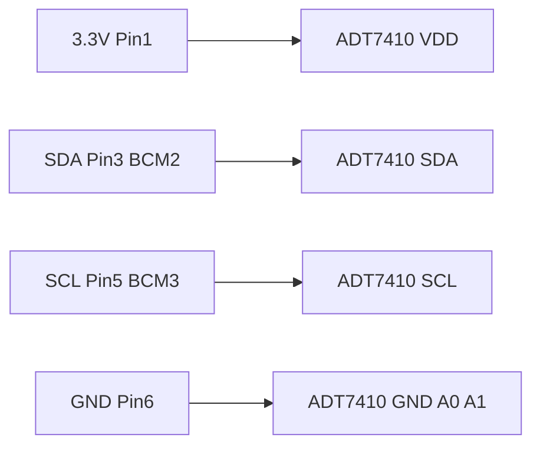

# I2C Scan 検証仕様

既知 address の I2C device を 1 つ固定し、web-demo の I2C Scan が正しい address を返すことを実機で確認する。配線情報だけで同じ接続を再現できることが完了条件。

関連:

- 親 Issue: [#52 I2C Scan example を作成する](https://github.com/gurezo/chirimen-raspi-docker/issues/52)
- 子 Issue: [#116 I2C Scan の実機検証を行う](https://github.com/gurezo/chirimen-raspi-docker/issues/116)
- API flow（Demo-only）: [protocol.md の I2C Scan API flow](../architecture/protocol.md#i2c-scan-api-flow114)（#114）
- Scan UI: web-demo の I2C Scan（`#/i2c-scan`）。[#115](https://github.com/gurezo/chirimen-raspi-docker/issues/115)
- 操作手順つきガイド: 後続（#117）
- I2C 有効化: [raspberry-pi-setup.md](../guides/raspberry-pi-setup.md)（`scripts/enable-i2c.sh`）
- 参考: [chirimen-drivers `@chirimen/adt7410`](https://github.com/chirimen-oh/chirimen-drivers/tree/master/packages/adt7410)（address `0x48`。本仕様では scan のみ）

本仕様の対象は **I2C Scan 自体** である。ADT7410 の温度読み取りなど、特定センサの機能 Example は追加しない。

web-demo の I2C port 定数は `apps/web-demo/src/i2c-scan.ts` の `I2C_SCAN_PORT`（`1`）。`navigator.requestI2CAccess().ports.get(1)` で参照する。走査範囲は `0x03`–`0x77`（Runtime `scanI2cPort` と同じ）。

## 目的

Raspberry Pi 3 / 4 / 5 で共通の、3.3V I2C1 に接続する検証用 slave を 1 つに決める。web-demo の Scan UI はこの文書を正本とする。操作ガイドは #117。

## 検証デバイス

CHIRIMEN の I2C 基本デバイスであり、既存テストと [protocol.md](../architecture/protocol.md) も `0x48` を例にしている **ADT7410** を使う。

| 項目 | 値 |
| --- | --- |
| device | ADT7410（温度センサ。本仕様では scan 対象としてのみ使う） |
| expected address | `0x48`（A0 / A1 = GND の default） |
| bus | I2C1（`/dev/i2c-1`、`ports.get(1)`） |

手元が別デバイスの場合は、datasheet の address に読み替えて同じ手順で記録する。5V ロジックは使わない。

## ピン対応

| 役割 | BCM | 40-pin header 物理 pin | 備考 |
| --- | --- | --- | --- |
| SDA | `2` | `3` | Pi 3 / 4 / 5 で同一。I2C1 |
| SCL | `3` | `5` | Pi 3 / 4 / 5 で同一。I2C1 |
| 3.3V | — | `1` | 他の 3.3V ピンでも可 |
| GND | — | `6` | 他の GND ピンでも可。A0 / A1 も GND へ |

```text
requestI2CAccess()
  → ports.get(1)
  → 0x03–0x77 で open + writeByte(0x00)
  → 応答 address を hex 一覧（ADT7410 default なら 0x48）
```

GPIO LED Blink（BCM 26 / 物理 37）および GPIO Input（BCM 5 / 物理 29）とはピンが重ならない。同時配線できる。

## 必要部品

| 部品 | 数量 | 仕様 |
| --- | --- | --- |
| ADT7410 | 1 | I2C 温度センサ。A0 / A1 を GND にして address `0x48` |
| ジャンパワイヤ | 4 本以上 | SDA / SCL / 3.3V / GND へ |

モジュールに pull-up が無い場合は、SDA / SCL に 4.7kΩ を 3.3V へ上げる。多くの breakout は onboard pull-up 付き。

## 配線

3.3V I2C1。`writeByte(0x00)` に応答すれば scan 成功（温度レジスタは読まない）。

```text
3.3V (物理 pin 1)
  → ADT7410 VDD

SDA (物理 pin 3 / BCM 2)
  → ADT7410 SDA

SCL (物理 pin 5 / BCM 3)
  → ADT7410 SCL

GND (物理 pin 6)
  → ADT7410 GND
  → ADT7410 A0
  → ADT7410 A1
```



手順:

1. ADT7410 の **VDD** を **物理 pin 1**（3.3V）へ接続する
2. **SDA** を **物理 pin 3**（BCM 2）へ接続する
3. **SCL** を **物理 pin 5**（BCM 3）へ接続する
4. **GND** と **A0** / **A1** を **物理 pin 6**（GND）へ接続する

## 3.3V I2C で安全な構成

Raspberry Pi の I2C は **3.3V** ロジックである。本配線は 3.3V 電源のみを使う。

| 項目 | 値 |
| --- | --- |
| I2C 電圧 | 3.3 V |
| expected address | `0x48` |
| pull-up | 3.3V 側。5V pull-up は使わない |

禁止:

- **5V ピン**（物理 pin 2 / 4）へ VDD や SDA / SCL を接続しない
- 5V ロジックの I2C device をレベルシフト無しで接続しない
- GPIO 同士を短絡しない
- A0 / A1 を 3.3V に上げたまま `0x48` を期待しない（address が変わる）

## Raspberry Pi 3 / 4 / 5 の pin assignment

| 確認項目 | 結果 |
| --- | --- |
| 40-pin header | Pi 3 / 4 / 5 で物理 pin 3 = SDA（BCM 2）、pin 5 = SCL（BCM 3） |
| default I2C | `/dev/i2c-1`。web-demo の `ports.get(1)` と一致 |
| LED Blink | BCM 26（物理 37）。本配線の 2 / 3 とは重ならない |
| GPIO Input | BCM 5（物理 29）。本配線の 2 / 3 とは重ならない |

モデルごとに配線を変える必要はない。Compatibility matrix は [docker.md](../architecture/docker.md#compatibility-matrix) を参照。

## 期待結果

配線後、host で `/dev/i2c-1` があり、`i2cdetect -y 1`（`i2c-tools` がある場合）に `48` が出る。web-demo の I2C Scan（`#/i2c-scan`）で Scan すると、hex 一覧に **`0x48`** が含まれる。

slave 未接続時の空配列は Runtime 確認（[#99](https://github.com/gurezo/chirimen-raspi-docker/issues/99)）では正常だが、本 Issue の完了条件ではない。空配列は失敗として、配線と I2C 有効化を見直す。操作手順・Troubleshooting の本ガイドは #117。切り分けは [troubleshooting.md](../guides/troubleshooting.md) の「I2C が使えない / scan が空」。

## 確認手順

1. I2C を有効化する: `sudo ./scripts/enable-i2c.sh` → reboot → `sudo ./scripts/enable-i2c.sh --check`
2. host で `ls -l /dev/i2c-1`
3. 上記のとおり ADT7410 を接続する
4. expected address を host で確認する（任意: `sudo apt install i2c-tools` のあと `i2cdetect -y 1` で `48`）
5. `./scripts/doctor.sh` → `./scripts/start.sh`
6. `docker compose exec chirimen-server ls -l /dev/i2c-1`
7. `pnpm nx serve web-demo` → `http://localhost:4200/#/i2c-scan`
8. 接続状態が Connected になったら Scan を押し、一覧に `0x48` が出ることを確認する

## 実機検証（#116）

I2C1 の pin assignment は Pi 3 / 4 / 5 で同一。`/dev/i2c-1` と Runtime `i2c-dev` は既存の Compatibility matrix で確認済み。Browser Scan の probe は Runtime `scanI2cPort` と同じ。

| 項目 | 結果 |
| --- | --- |
| 検証 device | ADT7410。expected `0x48`（A0 / A1 = GND） |
| 一次環境 | Raspberry Pi 5 Model B Rev 1.0 / Raspbian OS 64-bit / `aarch64` / kernel `6.18.34+rpt-rpi-2712`（[#99](https://github.com/gurezo/chirimen-raspi-docker/issues/99)） |
| host `/dev/i2c-1` | 有効化後に存在。Pi 3 B+（#97 / #135）/ Pi 4（#98 / #135）でも同様 |
| Runtime scan | Pi 5 で port `1` scan 成功。slave 未接続時は空配列（#99） |
| Browser Scan | `#/i2c-scan` の Scan。`open` + `writeByte(0x00)` を `0x03`–`0x77`（#114 / #115） |
| 完了条件 | 配線後の hex 一覧に `0x48`。空配列は失敗 |
| 対象外 | ADT7410 の温度読み取りなどセンサ機能 Example |

詳細は [docker.md の I2C Scan 実機検証](../architecture/docker.md) を参照。
